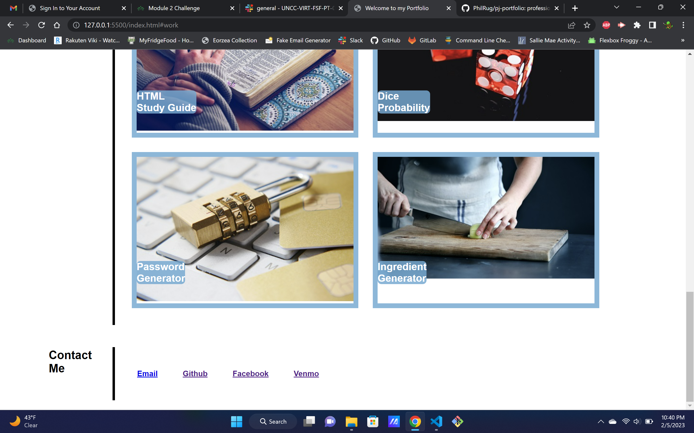

# pj-portfolio

## professional coding portfolio

This is my professional portfolio. I made this website as a place to organize all my current and future projects. Future employers should hopefully use this page as a resource to evaluate my coding capabilities. This project really let me play around with flexbox and taught me how to link <a> tags</a> to different elements on my site.

images are courtesy of https://unsplash.com/

 
 
 
  